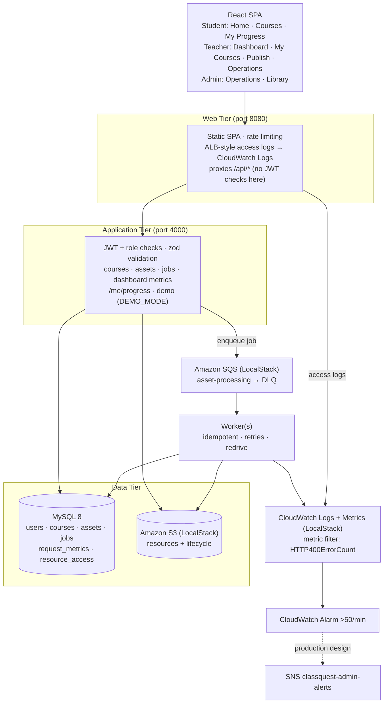
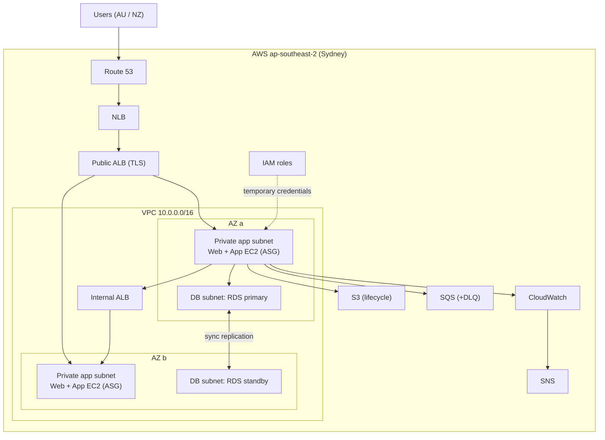
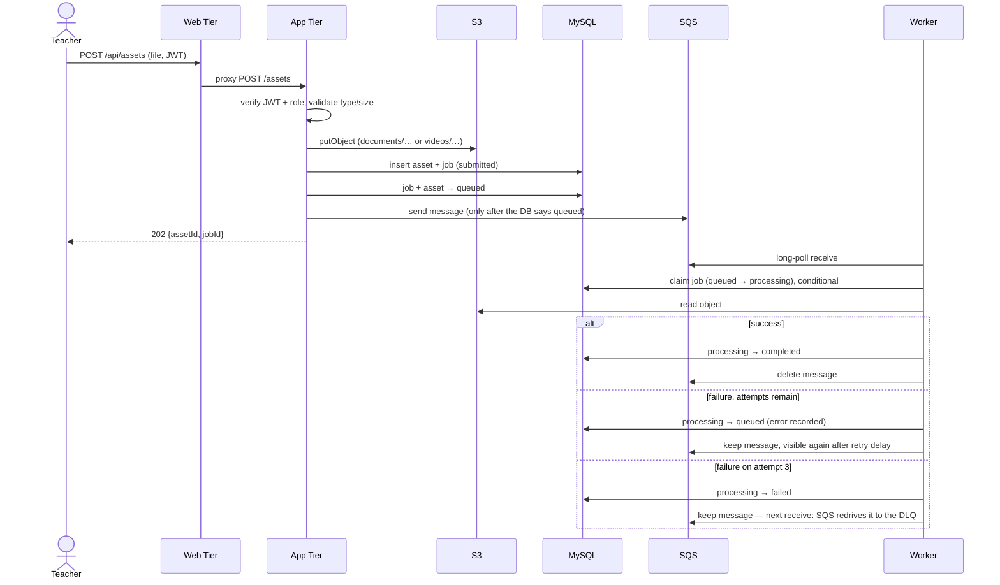
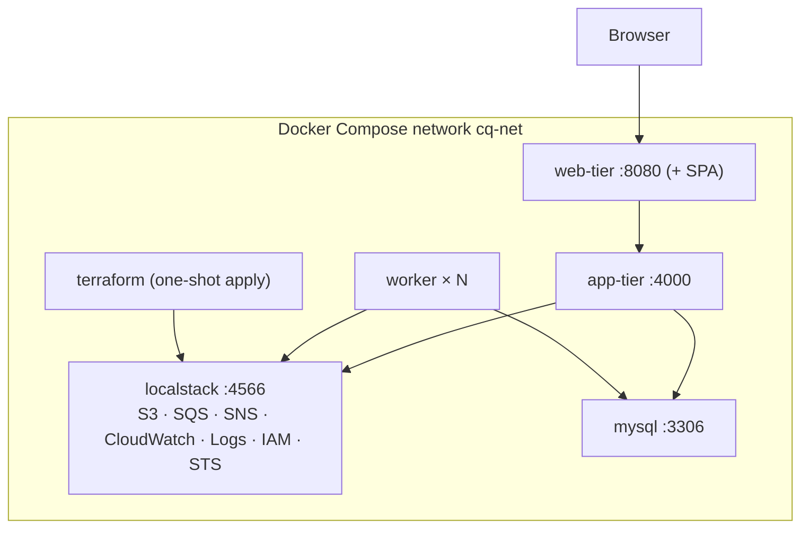

# ClassQuest Cloud Prototype — Architecture

> A research proof-of-concept of the AWS architecture in the INFS803 report
> _Cloud Solution Architecture Report — On-Premises to AWS Migration: ClassQuest_
> (Evans & Bien, S2 2026). Section references (`§`) point into that report.
>
> This document separates **what this prototype implements** from **the
> production AWS architecture described in the report**. The prototype runs
> real AWS service APIs on LocalStack; it does not provision the report's full
> production network and compute layer.

---

## 1. System overview

ClassQuest is a learning platform where **teachers publish** documents,
digital books and videos — organised into **courses** — and **students open**
them (`§1.2`). The report
proposes moving a legacy on-premises three-tier deployment to a highly
available, elastic, secure AWS three-tier architecture (`§1.3`, `§3`).

The prototype demonstrates the architecture's core behaviour end to end: a
**Web Tier → Application Tier → Data Tier (MySQL + S3)** with an
**asynchronous SQS pipeline and worker**, dead-letter handling,
lifecycle-tiered object storage, and CloudWatch-based monitoring of the
report's specific alert ("more than 50 HTTP 400 errors per minute", `§2.2.8`).

## 2. Implemented in this prototype vs production design

| Concern | Implemented in this prototype | Production AWS architecture (report) |
|---|---|---|
| Entry / load balancing | Web Tier container (Express) on port 8080: serves SPA, rate limits, proxies `/api` | Route 53 → NLB → public ALB with TLS; internal ALB to the app tier (`§3.4`, `§4.7–4.8`) |
| Compute | Docker containers: web-tier, app-tier, worker (scale with `--scale worker=N`) | EC2 Auto Scaling groups in private subnets across two AZs (`§5.1`) |
| Network isolation | One Docker bridge network; MySQL and the App Tier ports are also published to the host for development/tests | VPC with public/private/DB subnets, security groups, NACLs (`§4`, `§6.4–6.5`) |
| Database | MySQL 8 container (schema 5.7-compatible) | Amazon RDS for MySQL Multi-AZ (`§5.3`) |
| Object storage | **S3 on LocalStack** via Terraform: versioning, Block Public Access, SSE, lifecycle rule | Amazon S3 with the same configuration (`§5.4`) |
| Async processing | **SQS + DLQ on LocalStack** via Terraform; worker container | SQS + worker fleet (`§3.7`, `§10.10`) |
| Monitoring | **CloudWatch Logs, metric filter, alarm on LocalStack** via Terraform; app metrics | CloudWatch with alarm evaluation (`§7.6–7.7`) |
| Alerting | **SNS topic + email subscription on LocalStack** via Terraform; no email is delivered locally | SNS email to administrators (`§7.8`) |
| Identity for services | **IAM roles/instance profiles on LocalStack** via Terraform; not enforced by LocalStack Community | IAM instance profiles, least privilege (`§2.3.6`, `§6.2`) |
| Edge protection | Express rate limiting | AWS WAF and Shield (`§6.11`) |
| Secrets | Environment variables (`.env`, git-ignored) | Secrets Manager / SSM (`§6.10`) |
| Audit / threat detection | — | CloudTrail, Config, GuardDuty (`§6.13`) |

**Terraform in this repository** (`infra/terraform`) provisions only S3, SQS
(+DLQ), SNS, CloudWatch (log group, metric filter, alarm) and IAM roles. It
does **not** provision a VPC, subnets, EC2, ALB/NLB, Route 53, RDS, WAF or
Secrets Manager — those exist only in the report's design.

## 3. Architectural drivers

| Driver | Source | Response |
|--------|--------|----------|
| Eliminate single points of failure | `§2.2.3` | Stateless decoupled tiers; production: multi-AZ + RDS Multi-AZ |
| Absorb school-hour traffic spikes | `§2.2.4`, `§2.3.1` | SQS buffers work; workers scale horizontally |
| Scale storage independently of compute | `§2.1.5`, `§2.3.4` | S3 object storage |
| 5-year tiered retention | `§2.2.5`, `§5.4` | S3 lifecycle: Standard → Glacier @90 d → expire @1825 d |
| Least-privilege service access | `§2.3.6`, `§6.2` | IAM roles per tier (provisioned; enforced on AWS only) |
| Alert on >50 HTTP 400 / min | `§2.2.8`, `§7.6` | Access logs → metric filter → alarm → SNS |
| Reproducibility | `§2.7` | Terraform + one-command Docker Compose stack |

## 4. Logical architecture (as implemented)



## 5. Production cloud architecture (report §3.4 — documented, not provisioned)



In the prototype this layer is represented by Docker Compose networking and the
Web Tier container. See §2 for the mapping.

## 6. Upload → process → open (as implemented)



Opening a resource: `GET /api/assets/:id` returns a 5-minute presigned S3 URL.
Students only receive completed assets of published courses (others return
404). For students, the same request records the open in `resource_access`.

## 7. Job processing and dead-letter handling

- **Write order (race-free).** The App Tier stores the file, creates the asset
  and job, moves both to `queued`, and only then sends the SQS message. If the
  send fails, the job and asset are marked `failed` and the API returns 503.
- **Idempotent worker.** Every state change is a conditional update that
  follows the job state machine (`submitted → queued → processing →
  completed | failed`, with `processing → queued` for retries). A completed or
  failed job is never claimed again; duplicate deliveries are harmless.
- **Native SQS redrive.** The worker never deletes a failing message. It makes
  the message visible again after `WORKER_RETRY_DELAY_SECONDS` (default 5 s).
  On the third delivery the job is marked `failed`; on the next receive SQS's
  redrive policy (`maxReceiveCount = 3`, set in Terraform) moves the message to
  `classquest-asset-processing-dlq`. The worker reads `maxReceiveCount` from
  the queue at start-up so the two cannot drift apart.
- **Known edge case.** If a worker crashes during the final attempt, SQS still
  redrives the message, but the job can remain `processing` in MySQL.

## 8. Courses

A **course** groups resources; it is a domain layer on top of the unchanged
asset pipeline (no new AWS services).

```
courses(id, title, description, category, cover_key, cover_content_type,
        creator_id → users, status draft|published|archived, is_demo,
        created_at, updated_at)
assets(…existing columns…, course_id → courses NOT NULL, description,
       section_label NULL, display_order)
```

- **Lifecycle.** `draft → published → draft`, `draft|published → archived`,
  `archived → draft` (never straight back to published). Teachers manage only
  the courses they created; admins manage any course.
- **Visibility.** Students see a resource only when it is `completed` **and**
  its course is `published` — in `GET /courses`, `GET /courses/:id`,
  `GET /assets` and `GET /assets/:id` (presigned URL) alike. Drafts and
  archived courses answer 404 to students. Archived courses keep their
  resources and access history but accept no new resources.
- **Upload into a course.** `POST /assets` requires `courseId` (plus optional
  `description`, `sectionLabel`, `displayOrder`). The App Tier checks the
  course (exists, caller manages it, not archived) and then runs the same
  `publishAsset` write order as before: S3 → MySQL (`submitted → queued`) →
  SQS → Worker.
- **Order.** `display_order` (ascending, ties by creation time); new
  resources are appended. `PUT /courses/:id/order` re-numbers the whole list
  in one transaction.
- **Covers.** Optional PNG/JPEG/WebP (≤ 2 MB) stored in the same bucket under
  `pictures/covers/<courseId>/` and shown through 15-minute presigned URLs;
  without one, a category-tinted placeholder is drawn. The Web Tier CSP allows
  images from the browser-facing S3 endpoint for this.

**Migration (additive, idempotent, under a MySQL named lock).** The App Tier
creates `courses`, adds the four asset columns (with `course_id` nullable at
first), then gives any asset without a course to one generated, **published**
course, *General Library* (fixed id `00000000-0000-4000-8000-000000000001`,
owned by the uploader of the oldest such asset), and finally makes
`course_id` `NOT NULL` with an index and a foreign key. This was preferred
over leaving `course_id` nullable: every resource then belongs to exactly one
course, the student visibility rule has no "unassigned" special case, and
students keep exactly the access they had before the upgrade. Teachers can
move those resources into other courses from the course page.

## 9. Student progress (resource access)

`resource_access(user_id, asset_id, first_opened_at, last_opened_at,
open_count)` records which completed resources each student has opened. An
open is recorded only when a student successfully obtains a presigned URL; a
tracking failure never blocks access. `GET /me/progress` (students only)
returns `available`, `opened`, `coverage`, `lastOpenedAt`, per-type counts,
per-course counts (`courses[]`: opened, available, coverage) and recent opens.
Only completed resources of published courses count, on both sides, so
`opened ≤ available` everywhere.

This is **access tracking only** — it does not measure grades, mastery, time
spent or lesson completion.

## 10. Deployment (prototype runtime)



Start order: LocalStack and MySQL (healthy) → Terraform apply → App Tier
(migrates schema, creates demo users) → Worker and Web Tier.

## 11. Components

| Component | Responsibility | Report § |
|-----------|----------------|----------|
| `apps/frontend` | React SPA; role-based routes and navigation | §15 |
| `services/web-tier` | Public entry; SPA; rate limiting; access logs to CloudWatch; `/api` proxy | §4.8, §6.11, §7.6 |
| `services/app-tier` | Auth, authorisation, validation; assets, jobs, metrics, progress, demo | §3.4 |
| `services/worker` | SQS consumer; idempotent processing; retries; redrive | §3.7, §10.10 |
| `packages/shared` | Config, logging, domain, DB + migrations, AWS clients | §6, §7 |
| `infra/terraform` | S3, SQS + DLQ, SNS, CloudWatch, IAM (LocalStack or AWS target) | §2.7, §3.9 |

## 12. Security (summary — see `SECURITY.md`)

- JWT (1 h) + bcrypt; role checks in the **App Tier** on every protected route.
  The Web Tier only proxies.
- Students: completed assets only, own progress only. Job endpoints, metrics,
  uploads and demo management: teacher/admin.
- Demo endpoints exist only when `DEMO_MODE=true`.
- S3 Block Public Access; downloads via short-lived presigned URLs only.
- zod validation and a file-type/size allow-list; parameterised SQL.

## 13. Scalability and availability

- Web, App and Worker tiers are stateless; workers scale with
  `docker compose up -d --scale worker=3`.
- SQS decouples upload from processing, absorbing bursts.
- Production availability (multi-AZ, RDS failover, health-checked load
  balancers) is part of the report design, not exercised locally.

## 14. Monitoring

- Structured JSON logs (pino) with secret redaction.
- Web Tier writes one ALB-style JSON access-log event per request to
  CloudWatch Logs; Terraform defines a metric filter on `status_code = 400`
  and an alarm at >50 per 60 s with an SNS action.
- The App Tier keeps its own request log in MySQL; Operations shows HTTP 400s
  from that log because LocalStack Community does not evaluate the alarm.
- See `docs/OBSERVABILITY.md`.

## 15. Failure scenarios

| Scenario | Behaviour |
|----------|-----------|
| Worker crashes mid-job | Message reappears after its visibility timeout; job re-claimed |
| Processing keeps failing | Two retries, job `failed` on attempt 3, SQS redrives message to the DLQ |
| Duplicate SQS delivery | Ignored for completed jobs; failed jobs left for redrive |
| SQS unavailable during upload | Job/asset marked `failed`, API returns 503 |
| MySQL, S3 or SQS down | `/health` returns 503; Operations shows the service as unavailable |
| CloudWatch or SNS down | `/health` reports `degraded-observability` (200); app keeps serving |
| Invalid upload | 400/413 with a sanitised message; nothing stored |

## 16. Prototype limitations

1. Only S3, SQS, SNS, CloudWatch and IAM are provisioned (on LocalStack); the
   production network/compute/database layer is documented only (§2).
2. LocalStack Community does not evaluate CloudWatch alarm state from metric
   data, so the HTTP 400 alarm is not expected to reach `ALARM` locally; SNS
   email is never delivered.
3. Glacier is simulated on demand by rewriting objects with the `GLACIER`
   storage class; restore and retrieval latency are not emulated.
4. IAM is not enforced by LocalStack Community, and the app role does not yet
   include every action the app performs (see `SECURITY.md`).
5. The Teacher Dashboard's pipeline counts and Recent Resources are
   library-wide; only its *My Courses* card is limited to the teacher's own
   courses. There are no per-teacher or per-student analytics.
6. Worker "processing" only reads the object back from S3.
7. All data is synthetic `DEMO/SAMPLE`; no real TLS, DNS or billing locally.
